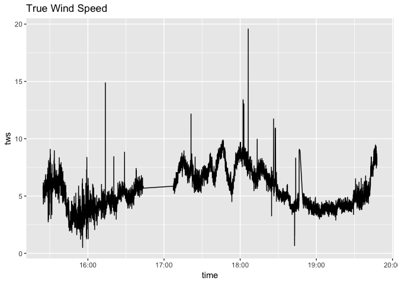
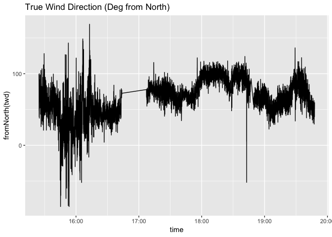
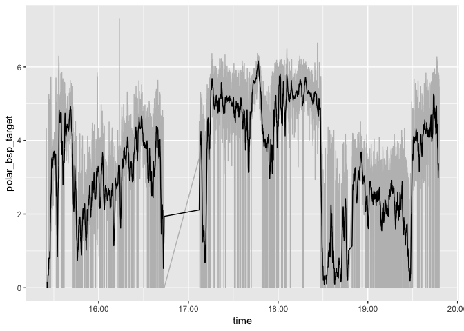
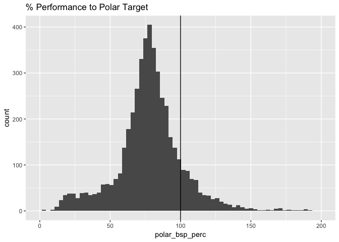
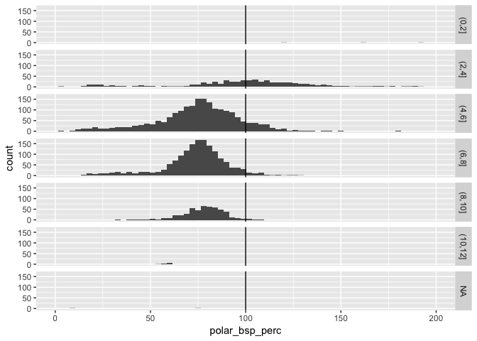
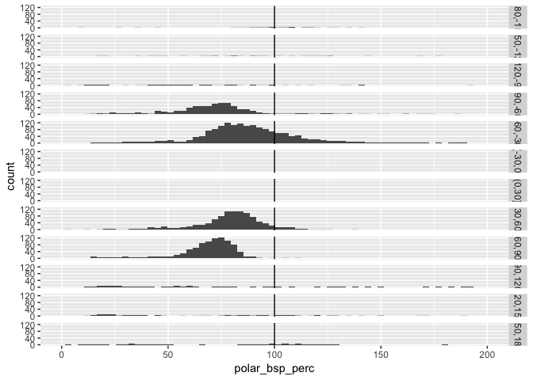

2018 BYC Long Distance Race
================

Background
----------

The Bayview Yacht Club hosts an annual Long Distance race around Lake St. Clair in Michigan. This is an analysis of the performance of the Yacht Zubenelgenubi in that race.

Source Data
-----------

The data from the race is collected from three on-board instruments: - Raymarine Wind Guage - Raymarine Boat Speed - Garmin GPS Plotter

These devices transmit NMEA sentances which is multiplexed and then broadcast over wifi using a [MiniPlex-3](http://www.shipmodul.com/en/miniplex-3.html).

The data is then read into [Expedition](http://www.expeditionmarine.com/about.htm) sailing software and logged as a csv file.

Load Data
---------

``` r
library(tidyverse)

#Read the Raw Data
expdat <- read.csv("../raw_data/exp_log.csv", stringsAsFactors = FALSE)

#Change the Time
expdat$time <- as.POSIXct((expdat$Utc) * (60*60*24), origin = "1899-12-30", tz = "GMT")
attributes(expdat$time )$tzone <- "America/Detroit"


#Remove any All NA Columns
#Find columns where all is NA
allna <- which(apply(expdat, 2, function(x) all(is.na(x))))   

#remove those columns
expdat <- expdat %>% select(-allna)

#Select only needed columns
expdat <- expdat %>% select(time, Bsp, Awa, Aws, Twa, Tws, Twd, Lat, Lon, Hdg, Cog, Sog)

#change names to lowercase for easier handling
names(expdat) <- tolower(names(expdat))

#Remove any rows where we don't have all data
expdat <- na.omit(expdat)

summary(expdat)
```

    ##       time                          bsp             awa        
    ##  Min.   :2018-09-15 15:24:39   Min.   :0.000   Min.   :-179.5  
    ##  1st Qu.:2018-09-15 16:21:54   1st Qu.:2.610   1st Qu.: -33.0  
    ##  Median :2018-09-15 17:45:32   Median :3.120   Median : -18.5  
    ##  Mean   :2018-09-15 17:38:27   Mean   :3.042   Mean   :   0.5  
    ##  3rd Qu.:2018-09-15 18:46:43   3rd Qu.:3.750   3rd Qu.:  36.5  
    ##  Max.   :2018-09-15 19:47:46   Max.   :5.530   Max.   : 180.0  
    ##       aws              twa                 tws              twd        
    ##  Min.   : 1.100   Min.   :-179.7000   Min.   : 0.510   Min.   :  0.10  
    ##  1st Qu.: 6.100   1st Qu.: -52.2250   1st Qu.: 4.210   1st Qu.: 51.10  
    ##  Median : 7.200   Median : -29.9000   Median : 5.270   Median : 67.90  
    ##  Mean   : 7.666   Mean   :  -0.2935   Mean   : 5.639   Mean   : 71.51  
    ##  3rd Qu.: 9.300   3rd Qu.:  58.0000   3rd Qu.: 6.790   3rd Qu.: 85.30  
    ##  Max.   :80.500   Max.   : 180.0000   Max.   :76.900   Max.   :359.80  
    ##       lat             lon              hdg              cog       
    ##  Min.   :42.35   Min.   :-82.90   Min.   :  0.00   Min.   :  0.0  
    ##  1st Qu.:42.35   1st Qu.:-82.89   1st Qu.: 38.77   1st Qu.: 38.8  
    ##  Median :42.37   Median :-82.82   Median :104.00   Median :104.0  
    ##  Mean   :42.38   Mean   :-82.82   Mean   :106.97   Mean   :106.9  
    ##  3rd Qu.:42.40   3rd Qu.:-82.77   3rd Qu.:123.50   3rd Qu.:123.4  
    ##  Max.   :42.41   Max.   :-82.72   Max.   :360.00   Max.   :360.0  
    ##       sog      
    ##  Min.   :0.38  
    ##  1st Qu.:2.73  
    ##  Median :3.09  
    ##  Mean   :3.22  
    ##  3rd Qu.:3.97  
    ##  Max.   :5.31

#### Clean up the Expdition Data

``` r
#Remove huge outliers
expdat <- expdat[expdat$aws < 30, ]   #we definitely didn't encounter anything over 20 kts
```

Path Sailed
-----------

Wind Direction & Speed
----------------------

``` r
source("../src/optimalPerformanceFunctions.R")

ggplot(expdat) + geom_path(aes(x=time, y=tws)) + ggtitle("True Wind Speed")
```



``` r
ggplot(expdat) + geom_path(aes(x=time, y=fromNorth(twd))) + ggtitle("True Wind Direction (Deg from North)")
```



Calculate Polar Boatspeed
-------------------------

``` r
library(akima)
library(zoo)
```

    ## 
    ## Attaching package: 'zoo'

    ## The following objects are masked from 'package:base':
    ## 
    ##     as.Date, as.Date.numeric

``` r
load("../raw_data/polarmodel.rda")

expdat$polar_bsp_target <- getOptV(btw = expdat$twa, vtw = expdat$tws, pol.model)
expdat$polar_rollmean <- rollmean(expdat$polar_bsp_target, k = 30, na.pad = TRUE)

ggplot(expdat) + 
  geom_path(aes(x=time, y=polar_bsp_target), color="gray")+
  geom_path(aes(x=time, y=polar_rollmean))
```

    ## Warning: Removed 29 rows containing missing values (geom_path).



``` r
  #geom_path(aes(x=time, y=bsp)) 
```

Distribution of Performance
---------------------------

``` r
expdat$off_polar <- expdat$polar_bsp_target - expdat$bsp

expdat$polar_bsp_perc <-  expdat$bsp / expdat$polar_bsp_target * 100

ggplot(expdat) + 
  geom_histogram(aes(x=polar_bsp_perc), binwidth=3)+
  scale_x_continuous(limits=c(0,200)) + 
  geom_vline(xintercept=100) +
  ggtitle ("% Performance to Polar Target")
```

    ## Warning: Removed 1261 rows containing non-finite values (stat_bin).

    ## Warning: Removed 1 rows containing missing values (geom_bar).



### Distributino by Wind Speed

``` r
expdat$tws_range <- cut(expdat$tws, breaks = c(0, 2, 4, 6,  8, 10, 12))

ggplot(expdat) + 
  geom_histogram(aes(x=polar_bsp_perc), binwidth=3)+
  scale_x_continuous(limits=c(0,200)) + 
  geom_vline(xintercept=100)+
  facet_grid(tws_range ~ .)
```

    ## Warning: Removed 1261 rows containing non-finite values (stat_bin).

    ## Warning: Removed 7 rows containing missing values (geom_bar).



### Distribution by Wind Angle

``` r
expdat$twa_range <- cut(expdat$twa, breaks = seq(-180, 180, by=30))

ggplot(expdat) + 
  geom_histogram(aes(x=polar_bsp_perc), binwidth=3)+
  scale_x_continuous(limits=c(0,200)) + 
  geom_vline(xintercept=100)+
  facet_grid(twa_range ~ .)
```

    ## Warning: Removed 1261 rows containing non-finite values (stat_bin).

    ## Warning: Removed 10 rows containing missing values (geom_bar).



Optimal VMC
-----------

``` r
library(geosphere)
marks <- data.frame(mk.lon=-82.68310, mk.lat=42.42992)


#bearing to mark
expdat$btm <- expdat$btm <- bearingRhumb(expdat[, c("lon", "lat")], marks)

#Calculate Optimal VMC
optimalcourse <- mapply(FUN = optvmc, expdat$btm, expdat$twd, expdat$tws, MoreArgs = list(pol.model), SIMPLIFY = FALSE)

optimalcourse <- do.call(bind_rows, optimalcourse)
  
expdat <- bind_cols(expdat, optimalcourse[, 4:9])
```

Save Data
---------

``` r
save(marks, file= "../2018_BYCLongDistance/mark.rda")
save(expdat, file =  "../2018_BYCLongDistance/expdat.rda")
```
